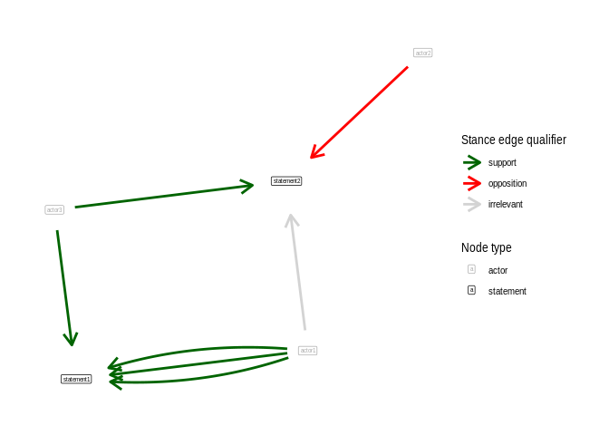
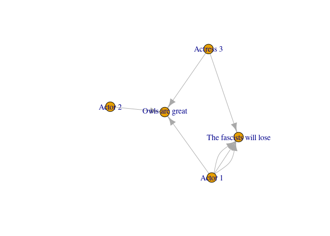
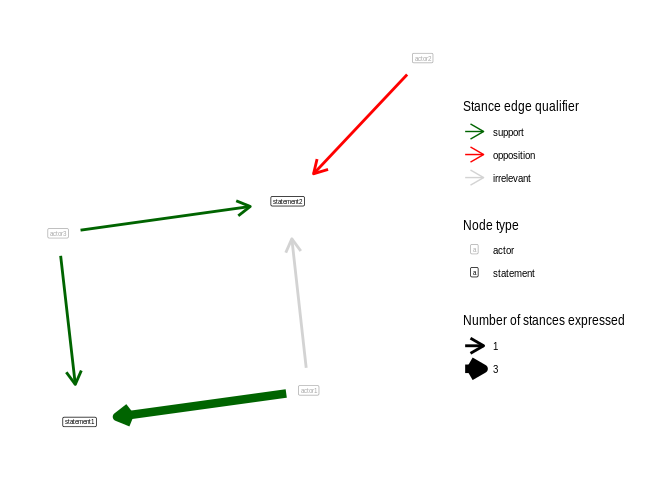
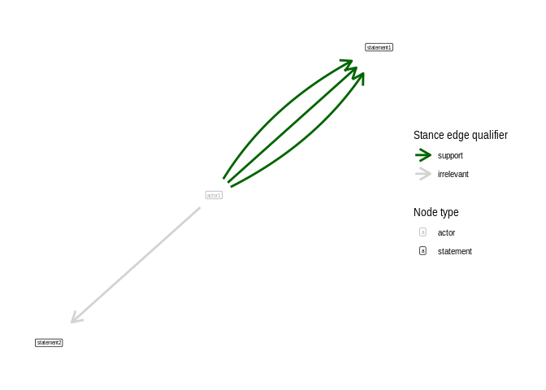
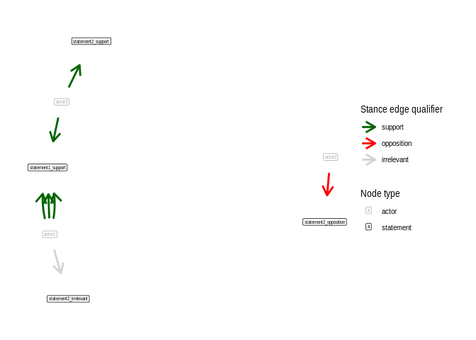

<!-- README.md is generated from README.Rmd. Please edit that file -->

# diskurs

<!-- badges: start -->

<!-- badges: end -->

⚠️ This package is at a very early stage of development ⚠️

diskurs (German for discourse) is an R package to handle data on
discourse networks in a very specific form.

The main goal of the package is to ensure validated data loading and
basic transformations of discourse in graph structure as introduced in
the [sustainability.discourses](sustainability.discourses.ch) project.

At the moment, it mainly exists to facilitate the reproduction of
analyses conducted within the
[sustainability.discourses](sustainability.discourses.ch) project. The
eventual goal is to hopefully support anyone working with a similar data
structure in the future.

`diskurs` is in most cases a thin wrapper or special use case around
[tidygraph](https://tidygraph.data-imaginist.com) and
[igraph](https://igraph.org).

## Installation

You can install the development version of diskurs from [the r-universe
builds of
diskurs](https://urban-sustainability-lab-zurich.r-universe.dev/diskurs)
with:

``` r
install.packages('diskurs', repos = c('https://urban-sustainability-lab-zurich.r-universe.dev', 'https://cloud.r-project.org'))
```

# Basic functionality

``` r
library(diskurs)
```

## Required data format

``` r
example_edgelist <- diskurs::edgelist_example
example_nodelist <- diskurs::nodelist_example
```

``` r
example_edgelist
#>   from to     stance  timestamp
#> 1    1  4    support 2012-02-01
#> 2    1  4    support 2013-02-01
#> 3    1  5 irrelevant 2014-02-01
#> 4    1  4    support 2014-04-01
#> 5    2  5 opposition 2016-02-01
#> 6    3  4    support 2016-02-01
#> 7    3  5    support 2016-03-01
```

``` r
example_nodelist
#>   nodeid       name                  label      mode
#> 1      1     actor1                Actor 1     actor
#> 2      2     actor2                Actor 2     actor
#> 3      3     actor3              Actress 3     actor
#> 4      4 statement1 The fascists will lose statement
#> 5      5 statement2         Owls are great statement
```

## Creating a discourse graph

``` r
disc_g <- load_discourse_graph(edgelist = example_edgelist, nodelist = example_nodelist)
disc_g
#>   ---------------------------------------- 
#> A discourse graph with 3 actors and 2
#>               statements 
#>   ----------------------------------------
#> [[1]]
#> [1] 5
#> 
#> [[2]]
#> [1] TRUE
#> 
#> [[3]]
#> [1] 0 0 0 0 1 2 2
#> 
#> [[4]]
#> [1] 3 3 4 3 4 3 4
#> 
#> [[5]]
#> NULL
#> 
#> [[6]]
#> NULL
#> 
#> [[7]]
#> NULL
#> 
#> [[8]]
#> NULL
#> 
#> [[9]]
#> [[9]][[1]]
#> [1] 1 0 1
#> 
#> [[9]][[2]]
#> named list()
#> 
#> [[9]][[3]]
#> [[9]][[3]]$nodeid
#> [1] 1 2 3 4 5
#> 
#> [[9]][[3]]$name
#> [1] "actor1"     "actor2"     "actor3"     "statement1" "statement2"
#> 
#> [[9]][[3]]$label
#> [1] "Actor 1"                "Actor 2"                "Actress 3"             
#> [4] "The fascists will lose" "Owls are great"        
#> 
#> [[9]][[3]]$mode
#> [1] "actor"     "actor"     "actor"     "statement" "statement"
#> 
#> 
#> [[9]][[4]]
#> [[9]][[4]]$stance
#> [1] "support"    "support"    "irrelevant" "support"    "opposition"
#> [6] "support"    "support"   
#> 
#> [[9]][[4]]$timestamp
#> [1] "2012-02-01" "2013-02-01" "2014-02-01" "2014-04-01" "2016-02-01"
#> [6] "2016-02-01" "2016-03-01"
#> 
#> 
#> 
#> [[10]]
#> <environment: 0x55e0c8a65de0>
#> 
#> attr(,"active")
#> [1] "nodes"
```

Let’s look at it:

``` r
disc_g |> plot()
```



In many cases, working with the igraph or tidygraph object is advisable

``` r
disc_g |> get_igraph()
#> IGRAPH 190a423 DN-- 5 7 -- 
#> + attr: nodeid (v/n), name (v/c), label (v/c), mode (v/c), stance
#> | (e/c), timestamp (e/n)
#> + edges from 190a423 (vertex names):
#> [1] actor1->statement1 actor1->statement1 actor1->statement2 actor1->statement1
#> [5] actor2->statement2 actor3->statement1 actor3->statement2
```

This makes it possible to use the entire ecosystem provided by igraph:

``` r
disc_g |>
  get_igraph() |>
  plot()
```



Or tidygraph. You can extract tidygraph’s tbl\_graph object and then use
its verbs:

``` r
disc_g |>
  get_tbl_graph() |>
  tidygraph::activate(nodes) |>
  dplyr::mutate(closeness = tidygraph::centrality_closeness())
#> # A tbl_graph: 5 nodes and 7 edges
#> #
#> # A directed acyclic multigraph with 1 component
#> #
#> # Node Data: 5 × 5 (active)
#>   nodeid name       label                  mode      closeness
#>    <int> <chr>      <chr>                  <chr>         <dbl>
#> 1      1 actor1     Actor 1                actor           0.5
#> 2      2 actor2     Actor 2                actor           1  
#> 3      3 actor3     Actress 3              actor           0.5
#> 4      4 statement1 The fascists will lose statement     NaN  
#> 5      5 statement2 Owls are great         statement     NaN  
#> #
#> # Edge Data: 7 × 4
#>    from    to stance     timestamp 
#>   <int> <int> <chr>      <date>    
#> 1     1     4 support    2012-02-01
#> 2     1     4 support    2013-02-01
#> 3     1     5 irrelevant 2014-02-01
#> # ℹ 4 more rows
```

Or maybe even better, you can use tidygraph verbs directly on
discourse\_graph objects:

``` r
disc_g |>
  tidygraph::activate(nodes) |>
  dplyr::filter(mode == "actor") |>
  tidygraph::activate(edges) |>
  dplyr::filter(stance == "support")
#>   ---------------------------------------- 
#> A discourse graph with 3 actors and 2
#>               statements 
#>   ----------------------------------------
#> [[1]]
#> [1] 3
#> 
#> [[2]]
#> [1] TRUE
#> 
#> [[3]]
#> numeric(0)
#> 
#> [[4]]
#> numeric(0)
#> 
#> [[5]]
#> NULL
#> 
#> [[6]]
#> NULL
#> 
#> [[7]]
#> NULL
#> 
#> [[8]]
#> NULL
#> 
#> [[9]]
#> [[9]][[1]]
#> [1] 1 0 1
#> 
#> [[9]][[2]]
#> named list()
#> 
#> [[9]][[3]]
#> [[9]][[3]]$nodeid
#> [1] 1 2 3
#> 
#> [[9]][[3]]$name
#> [1] "actor1" "actor2" "actor3"
#> 
#> [[9]][[3]]$label
#> [1] "Actor 1"   "Actor 2"   "Actress 3"
#> 
#> [[9]][[3]]$mode
#> [1] "actor" "actor" "actor"
#> 
#> 
#> [[9]][[4]]
#> [[9]][[4]]$stance
#> character(0)
#> 
#> [[9]][[4]]$timestamp
#> Date of length 0
#> 
#> 
#> 
#> [[10]]
#> <environment: 0x55e0d1b8a8f8>
#> 
#> attr(,"active")
#> [1] "edges"

disc_g |>
  tidygraph::activate(nodes) |>
  dplyr::mutate(
    degree = tidygraph::centrality_degree(),
    name_upper = toupper(name)
  )
#>   ---------------------------------------- 
#> A discourse graph with 3 actors and 2
#>               statements 
#>   ----------------------------------------
#> [[1]]
#> [1] 5
#> 
#> [[2]]
#> [1] TRUE
#> 
#> [[3]]
#> [1] 0 0 0 0 1 2 2
#> 
#> [[4]]
#> [1] 3 3 4 3 4 3 4
#> 
#> [[5]]
#> NULL
#> 
#> [[6]]
#> NULL
#> 
#> [[7]]
#> NULL
#> 
#> [[8]]
#> NULL
#> 
#> [[9]]
#> [[9]][[1]]
#> [1] 1 0 1
#> 
#> [[9]][[2]]
#> named list()
#> 
#> [[9]][[3]]
#> [[9]][[3]]$nodeid
#> [1] 1 2 3 4 5
#> 
#> [[9]][[3]]$name
#> [1] "actor1"     "actor2"     "actor3"     "statement1" "statement2"
#> 
#> [[9]][[3]]$label
#> [1] "Actor 1"                "Actor 2"                "Actress 3"             
#> [4] "The fascists will lose" "Owls are great"        
#> 
#> [[9]][[3]]$mode
#> [1] "actor"     "actor"     "actor"     "statement" "statement"
#> 
#> [[9]][[3]]$degree
#>     actor1     actor2     actor3 statement1 statement2 
#>          4          1          2          0          0 
#> 
#> [[9]][[3]]$name_upper
#> [1] "ACTOR1"     "ACTOR2"     "ACTOR3"     "STATEMENT1" "STATEMENT2"
#> 
#> 
#> [[9]][[4]]
#> [[9]][[4]]$stance
#> [1] "support"    "support"    "irrelevant" "support"    "opposition"
#> [6] "support"    "support"   
#> 
#> [[9]][[4]]$timestamp
#> [1] "2012-02-01" "2013-02-01" "2014-02-01" "2014-04-01" "2016-02-01"
#> [6] "2016-02-01" "2016-03-01"
#> 
#> 
#> 
#> [[10]]
#> <environment: 0x55e0c8a65de0>
#> 
#> attr(,"active")
#> [1] "nodes"
```

## Aggregating a graph

Aggregating a discourse graph here means combining stance edges to
weighted edges over time, possibly also keeping only the most prevalent
category.

``` r
disc_g |> aggregate_discourse_graph()
#>   ---------------------------------------- 
#> A aggregated discourse graph with 3 actors and 2
#>               statements 
#>   ----------------------------------------
#> [[1]]
#> [1] 5
#> 
#> [[2]]
#> [1] TRUE
#> 
#> [[3]]
#> [1] 0 0 1 2 2
#> 
#> [[4]]
#> [1] 3 4 4 3 4
#> 
#> [[5]]
#> NULL
#> 
#> [[6]]
#> NULL
#> 
#> [[7]]
#> NULL
#> 
#> [[8]]
#> NULL
#> 
#> [[9]]
#> [[9]][[1]]
#> [1] 1 0 1
#> 
#> [[9]][[2]]
#> named list()
#> 
#> [[9]][[3]]
#> [[9]][[3]]$nodeid
#> [1] 1 2 3 4 5
#> 
#> [[9]][[3]]$name
#> [1] "actor1"     "actor2"     "actor3"     "statement1" "statement2"
#> 
#> [[9]][[3]]$label
#> [1] "Actor 1"                "Actor 2"                "Actress 3"             
#> [4] "The fascists will lose" "Owls are great"        
#> 
#> [[9]][[3]]$mode
#> [1] "actor"     "actor"     "actor"     "statement" "statement"
#> 
#> 
#> [[9]][[4]]
#> [[9]][[4]]$stance
#> [1] "support"    "irrelevant" "opposition" "support"    "support"   
#> 
#> [[9]][[4]]$n_stances
#> [1] 3 1 1 1 1
#> 
#> [[9]][[4]]$timestamp
#> [1] "2016-03-01" "2016-03-01" "2016-03-01" "2016-03-01" "2016-03-01"
#> 
#> 
#> 
#> [[10]]
#> <environment: 0x55e0cd9117b8>
#> 
#> attr(,"active")
#> [1] "nodes"
```

``` r
disc_g |> aggregate_discourse_graph(keep_only_highest = TRUE) |> plot()
```



## Time slices of discourse graphs

``` r
start_date <- "2012-01-01"
end_date <- "2014-06-06"
disc_g |>
  time_slice_graph(start_date = start_date, end_date = end_date)
#>   ---------------------------------------- 
#> A discourse graph with 3 actors and 2
#>               statements 
#>   ----------------------------------------
#> [[1]]
#> [1] 5
#> 
#> [[2]]
#> [1] TRUE
#> 
#> [[3]]
#> [1] 0 0 0 0
#> 
#> [[4]]
#> [1] 3 3 4 3
#> 
#> [[5]]
#> NULL
#> 
#> [[6]]
#> NULL
#> 
#> [[7]]
#> NULL
#> 
#> [[8]]
#> NULL
#> 
#> [[9]]
#> [[9]][[1]]
#> [1] 1 0 1
#> 
#> [[9]][[2]]
#> named list()
#> 
#> [[9]][[3]]
#> [[9]][[3]]$nodeid
#> [1] 1 2 3 4 5
#> 
#> [[9]][[3]]$name
#> [1] "actor1"     "actor2"     "actor3"     "statement1" "statement2"
#> 
#> [[9]][[3]]$label
#> [1] "Actor 1"                "Actor 2"                "Actress 3"             
#> [4] "The fascists will lose" "Owls are great"        
#> 
#> [[9]][[3]]$mode
#> [1] "actor"     "actor"     "actor"     "statement" "statement"
#> 
#> 
#> [[9]][[4]]
#> [[9]][[4]]$stance
#> [1] "support"    "support"    "irrelevant" "support"   
#> 
#> [[9]][[4]]$timestamp
#> [1] "2012-02-01" "2013-02-01" "2014-02-01" "2014-04-01"
#> 
#> 
#> 
#> [[10]]
#> <environment: 0x55e0d025fc30>
#> 
#> attr(,"active")
#> [1] "nodes"
```

``` r
disc_g |>
  time_slice_graph(start_date = start_date, end_date = end_date) |>
  plot()
```



You can also create a list of time sliced graphs directly.

``` r
date_range <- c(start_date, end_date)
time_window <- months(48)
```

``` r
disc_g |>
  time_sliced_graph_list(time_window = time_window,
                         date_range = date_range,
                         step_interval = "year")
#> $`2012-01-01`
#>   ---------------------------------------- 
#> A discourse graph with 3 actors and 2
#>               statements 
#>   ----------------------------------------
#> [[1]]
#> [1] 5
#> 
#> [[2]]
#> [1] TRUE
#> 
#> [[3]]
#> [1] 0 0
#> 
#> [[4]]
#> [1] 3 3
#> 
#> [[5]]
#> NULL
#> 
#> [[6]]
#> NULL
#> 
#> [[7]]
#> NULL
#> 
#> [[8]]
#> NULL
#> 
#> [[9]]
#> [[9]][[1]]
#> [1] 1 0 1
#> 
#> [[9]][[2]]
#> named list()
#> 
#> [[9]][[3]]
#> [[9]][[3]]$nodeid
#> [1] 1 2 3 4 5
#> 
#> [[9]][[3]]$name
#> [1] "actor1"     "actor2"     "actor3"     "statement1" "statement2"
#> 
#> [[9]][[3]]$label
#> [1] "Actor 1"                "Actor 2"                "Actress 3"             
#> [4] "The fascists will lose" "Owls are great"        
#> 
#> [[9]][[3]]$mode
#> [1] "actor"     "actor"     "actor"     "statement" "statement"
#> 
#> 
#> [[9]][[4]]
#> [[9]][[4]]$stance
#> [1] "support" "support"
#> 
#> [[9]][[4]]$timestamp
#> [1] "2012-02-01" "2013-02-01"
#> 
#> 
#> 
#> [[10]]
#> <environment: 0x55e0d0a54498>
#> 
#> attr(,"active")
#> [1] "nodes"
#> 
#> $`2013-01-01`
#>   ---------------------------------------- 
#> A discourse graph with 3 actors and 2
#>               statements 
#>   ----------------------------------------
#> [[1]]
#> [1] 5
#> 
#> [[2]]
#> [1] TRUE
#> 
#> [[3]]
#> [1] 0 0 0 0
#> 
#> [[4]]
#> [1] 3 3 4 3
#> 
#> [[5]]
#> NULL
#> 
#> [[6]]
#> NULL
#> 
#> [[7]]
#> NULL
#> 
#> [[8]]
#> NULL
#> 
#> [[9]]
#> [[9]][[1]]
#> [1] 1 0 1
#> 
#> [[9]][[2]]
#> named list()
#> 
#> [[9]][[3]]
#> [[9]][[3]]$nodeid
#> [1] 1 2 3 4 5
#> 
#> [[9]][[3]]$name
#> [1] "actor1"     "actor2"     "actor3"     "statement1" "statement2"
#> 
#> [[9]][[3]]$label
#> [1] "Actor 1"                "Actor 2"                "Actress 3"             
#> [4] "The fascists will lose" "Owls are great"        
#> 
#> [[9]][[3]]$mode
#> [1] "actor"     "actor"     "actor"     "statement" "statement"
#> 
#> 
#> [[9]][[4]]
#> [[9]][[4]]$stance
#> [1] "support"    "support"    "irrelevant" "support"   
#> 
#> [[9]][[4]]$timestamp
#> [1] "2012-02-01" "2013-02-01" "2014-02-01" "2014-04-01"
#> 
#> 
#> 
#> [[10]]
#> <environment: 0x55e0d0d23e58>
#> 
#> attr(,"active")
#> [1] "nodes"
#> 
#> $`2014-01-01`
#>   ---------------------------------------- 
#> A discourse graph with 3 actors and 2
#>               statements 
#>   ----------------------------------------
#> [[1]]
#> [1] 5
#> 
#> [[2]]
#> [1] TRUE
#> 
#> [[3]]
#> [1] 0 0 0 0
#> 
#> [[4]]
#> [1] 3 3 4 3
#> 
#> [[5]]
#> NULL
#> 
#> [[6]]
#> NULL
#> 
#> [[7]]
#> NULL
#> 
#> [[8]]
#> NULL
#> 
#> [[9]]
#> [[9]][[1]]
#> [1] 1 0 1
#> 
#> [[9]][[2]]
#> named list()
#> 
#> [[9]][[3]]
#> [[9]][[3]]$nodeid
#> [1] 1 2 3 4 5
#> 
#> [[9]][[3]]$name
#> [1] "actor1"     "actor2"     "actor3"     "statement1" "statement2"
#> 
#> [[9]][[3]]$label
#> [1] "Actor 1"                "Actor 2"                "Actress 3"             
#> [4] "The fascists will lose" "Owls are great"        
#> 
#> [[9]][[3]]$mode
#> [1] "actor"     "actor"     "actor"     "statement" "statement"
#> 
#> 
#> [[9]][[4]]
#> [[9]][[4]]$stance
#> [1] "support"    "support"    "irrelevant" "support"   
#> 
#> [[9]][[4]]$timestamp
#> [1] "2012-02-01" "2013-02-01" "2014-02-01" "2014-04-01"
#> 
#> 
#> 
#> [[10]]
#> <environment: 0x55e0d0fa0808>
#> 
#> attr(,"active")
#> [1] "nodes"
```

## Explode the graph

You can explodes all statement nodes into all existing combinations of
statements and stances. Easier to understand with an illustration:

``` r
disc_g |> explode_graph() |> plot()
```


