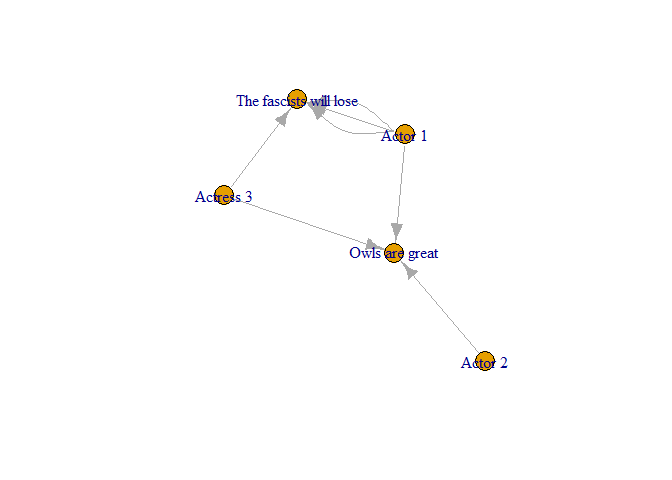

<!-- README.md is generated from README.Rmd. Please edit that file -->

# diskurs

<!-- badges: start -->
<!-- badges: end -->

⚠️ This package is at a very early stage of development ⚠️

diskurs (German for discourse) is an R package to handle data on
discourse networks in a very specific form.

The main goal of the package is to ensure validated data loading and
basic transformations of discourse in graph structure as introduced in
the [sustainability.discourses](sustainability.discourses.ch) project.

At the moment, it mainly exists to facilitate the reproduction of
analyses conducted within the
[sustainability.discourses](sustainability.discourses.ch) project. The
eventual goal is to hopefully support anyone working with a similar data
structure in the future.

`diskurs` is in most cases a thin wrapper or special use case around
[tidygraph](https://tidygraph.data-imaginist.com) and
[igraph](https://igraph.org).

## Installation

You can install the development version of diskurs from [the r-universe
builds of
diskurs](https://urban-sustainability-lab-zurich.r-universe.dev/diskurs)
with:

``` r
install.packages('diskurs', repos = c('https://urban-sustainability-lab-zurich.r-universe.dev', 'https://cloud.r-project.org'))
```

# Basic functionality

``` r
library(diskurs)
```

## Required data format

``` r
example_edgelist <- diskurs::edgelist_example
example_nodelist <- diskurs::nodelist_example
```

``` r
example_edgelist
#>   from to     stance  timestamp
#> 1    1  4    support 2012-02-01
#> 2    1  4    support 2013-02-01
#> 3    1  5 irrelevant 2014-02-01
#> 4    1  4    support 2014-04-01
#> 5    2  5 opposition 2016-02-01
#> 6    3  4    support 2016-02-01
#> 7    3  5    support 2016-03-01
```

``` r
example_nodelist
#>   nodeid       name                  label      mode
#> 1      1     actor1                Actor 1     actor
#> 2      2     actor2                Actor 2     actor
#> 3      3     actor3              Actress 3     actor
#> 4      4 statement1 The fascists will lose statement
#> 5      5 statement2         Owls are great statement
```

## Creating a discourse graph

``` r
disc_g <- load_discourse_graph(edgelist = example_edgelist, nodelist = example_nodelist)
disc_g
#>   ---------------------------------------- 
#> A discourse graph with 3 actors and 2
#>               statements 
#>   ----------------------------------------
#> # A tbl_graph: 5 nodes and 7 edges
#> #
#> # A directed acyclic multigraph with 1 component
#> #
#> # A tibble: 5 × 4
#>   nodeid name       label                  mode     
#>    <int> <chr>      <chr>                  <chr>    
#> 1      1 actor1     Actor 1                actor    
#> 2      2 actor2     Actor 2                actor    
#> 3      3 actor3     Actress 3              actor    
#> 4      4 statement1 The fascists will lose statement
#> 5      5 statement2 Owls are great         statement
#> #
#> # A tibble: 7 × 4
#>    from    to stance     timestamp 
#>   <int> <int> <chr>      <date>    
#> 1     1     4 support    2012-02-01
#> 2     1     4 support    2013-02-01
#> 3     1     5 irrelevant 2014-02-01
#> # ℹ 4 more rows
```

Let’s look at it:

``` r
disc_g |> plot()
```


In many cases, working with the igraph or tidygraph object is advisable

``` r
disc_g |> get_igraph()
#> IGRAPH 503552e DN-- 5 7 -- 
#> + attr: nodeid (v/n), name (v/c), label (v/c), mode (v/c), stance
#> | (e/c), timestamp (e/n)
#> + edges from 503552e (vertex names):
#> [1] actor1->statement1 actor1->statement1 actor1->statement2 actor1->statement1
#> [5] actor2->statement2 actor3->statement1 actor3->statement2
```

This makes it possible to use the entire ecosystem provided by igraph…

``` r
disc_g |> 
  get_igraph() |> 
  plot()
```



… or tidygraph.

``` r
disc_g |> 
  get_tbl_graph() |> 
  tidygraph::activate(nodes) |>
  dplyr::mutate(closeness = tidygraph::centrality_closeness())
#> # A tbl_graph: 5 nodes and 7 edges
#> #
#> # A directed acyclic multigraph with 1 component
#> #
#> # A tibble: 5 × 5
#>   nodeid name       label                  mode      closeness
#>    <int> <chr>      <chr>                  <chr>         <dbl>
#> 1      1 actor1     Actor 1                actor           0.5
#> 2      2 actor2     Actor 2                actor           1  
#> 3      3 actor3     Actress 3              actor           0.5
#> 4      4 statement1 The fascists will lose statement     NaN  
#> 5      5 statement2 Owls are great         statement     NaN  
#> #
#> # A tibble: 7 × 4
#>    from    to stance     timestamp 
#>   <int> <int> <chr>      <date>    
#> 1     1     4 support    2012-02-01
#> 2     1     4 support    2013-02-01
#> 3     1     5 irrelevant 2014-02-01
#> # ℹ 4 more rows
```

## Aggregating a graph

Aggregating a discourse graph here means combining stance edges to
weighted edges over time, possibly also keeping only the most prevalent
category.

``` r
disc_g |> aggregate_discourse_graph()
#>   ---------------------------------------- 
#> A aggregated discourse graph with 3 actors and 2
#>               statements 
#>   ----------------------------------------
#> # A tbl_graph: 5 nodes and 5 edges
#> #
#> # A directed acyclic simple graph with 1 component
#> #
#> # A tibble: 5 × 4
#>   nodeid name       label                  mode     
#>    <int> <chr>      <chr>                  <chr>    
#> 1      1 actor1     Actor 1                actor    
#> 2      2 actor2     Actor 2                actor    
#> 3      3 actor3     Actress 3              actor    
#> 4      4 statement1 The fascists will lose statement
#> 5      5 statement2 Owls are great         statement
#> #
#> # A tibble: 5 × 5
#>    from    to stance     n_stances timestamp 
#>   <int> <int> <chr>          <int> <date>    
#> 1     1     4 support            3 2016-03-01
#> 2     1     5 irrelevant         1 2016-03-01
#> 3     2     5 opposition         1 2016-03-01
#> # ℹ 2 more rows
```

``` r
disc_g |> aggregate_discourse_graph(keep_only_highest = TRUE) |> plot()
```


## Time slices of discourse graphs

``` r
start_date <- "2012-01-01"
end_date <- "2014-06-06"
disc_g |> 
  time_slice_graph(start_date = start_date, end_date = end_date)
#>   ---------------------------------------- 
#> A discourse graph with 3 actors and 2
#>               statements 
#>   ----------------------------------------
#> # A tbl_graph: 5 nodes and 4 edges
#> #
#> # A directed acyclic multigraph with 3 components
#> #
#> # A tibble: 5 × 4
#>   nodeid name       label                  mode     
#>    <int> <chr>      <chr>                  <chr>    
#> 1      1 actor1     Actor 1                actor    
#> 2      2 actor2     Actor 2                actor    
#> 3      3 actor3     Actress 3              actor    
#> 4      4 statement1 The fascists will lose statement
#> 5      5 statement2 Owls are great         statement
#> #
#> # A tibble: 4 × 4
#>    from    to stance     timestamp 
#>   <int> <int> <chr>      <date>    
#> 1     1     4 support    2012-02-01
#> 2     1     4 support    2013-02-01
#> 3     1     5 irrelevant 2014-02-01
#> # ℹ 1 more row
```

``` r
disc_g |> 
  time_slice_graph(start_date = start_date, end_date = end_date) |> 
  plot()
```


You can also create a list of time sliced graphs directly.

``` r
date_range <- c(start_date, end_date)
time_window <- months(48)
```

``` r
disc_g |> 
  time_sliced_graph_list(time_window = time_window,
                         date_range = date_range,
                         step_interval = "year")
#> $`2012-01-01`
#>   ---------------------------------------- 
#> A discourse graph with 3 actors and 2
#>               statements 
#>   ----------------------------------------
#> # A tbl_graph: 5 nodes and 2 edges
#> #
#> # A directed acyclic multigraph with 4 components
#> #
#> # A tibble: 5 × 4
#>   nodeid name       label                  mode     
#>    <int> <chr>      <chr>                  <chr>    
#> 1      1 actor1     Actor 1                actor    
#> 2      2 actor2     Actor 2                actor    
#> 3      3 actor3     Actress 3              actor    
#> 4      4 statement1 The fascists will lose statement
#> 5      5 statement2 Owls are great         statement
#> #
#> # A tibble: 2 × 4
#>    from    to stance  timestamp 
#>   <int> <int> <chr>   <date>    
#> 1     1     4 support 2012-02-01
#> 2     1     4 support 2013-02-01
#> 
#> $`2013-01-01`
#>   ---------------------------------------- 
#> A discourse graph with 3 actors and 2
#>               statements 
#>   ----------------------------------------
#> # A tbl_graph: 5 nodes and 4 edges
#> #
#> # A directed acyclic multigraph with 3 components
#> #
#> # A tibble: 5 × 4
#>   nodeid name       label                  mode     
#>    <int> <chr>      <chr>                  <chr>    
#> 1      1 actor1     Actor 1                actor    
#> 2      2 actor2     Actor 2                actor    
#> 3      3 actor3     Actress 3              actor    
#> 4      4 statement1 The fascists will lose statement
#> 5      5 statement2 Owls are great         statement
#> #
#> # A tibble: 4 × 4
#>    from    to stance     timestamp 
#>   <int> <int> <chr>      <date>    
#> 1     1     4 support    2012-02-01
#> 2     1     4 support    2013-02-01
#> 3     1     5 irrelevant 2014-02-01
#> # ℹ 1 more row
#> 
#> $`2014-01-01`
#>   ---------------------------------------- 
#> A discourse graph with 3 actors and 2
#>               statements 
#>   ----------------------------------------
#> # A tbl_graph: 5 nodes and 4 edges
#> #
#> # A directed acyclic multigraph with 3 components
#> #
#> # A tibble: 5 × 4
#>   nodeid name       label                  mode     
#>    <int> <chr>      <chr>                  <chr>    
#> 1      1 actor1     Actor 1                actor    
#> 2      2 actor2     Actor 2                actor    
#> 3      3 actor3     Actress 3              actor    
#> 4      4 statement1 The fascists will lose statement
#> 5      5 statement2 Owls are great         statement
#> #
#> # A tibble: 4 × 4
#>    from    to stance     timestamp 
#>   <int> <int> <chr>      <date>    
#> 1     1     4 support    2012-02-01
#> 2     1     4 support    2013-02-01
#> 3     1     5 irrelevant 2014-02-01
#> # ℹ 1 more row
```

## Explode the graph

You can explodes all statement nodes into all existing combinations of
statements and stances. Easier to understand with an illustration:

``` r
disc_g |> explode_graph() |> plot()
```


